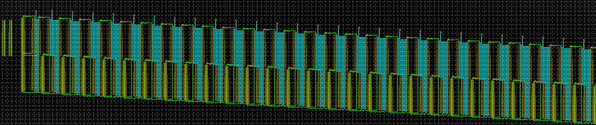
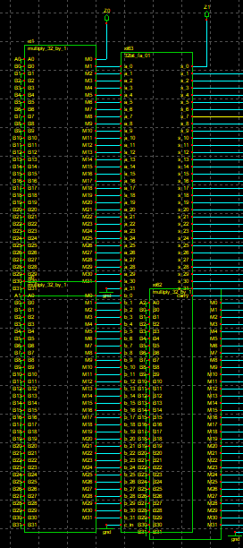
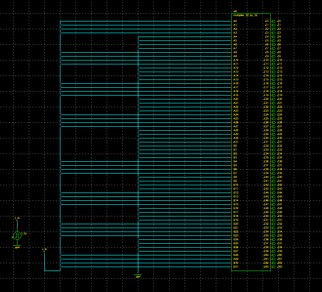
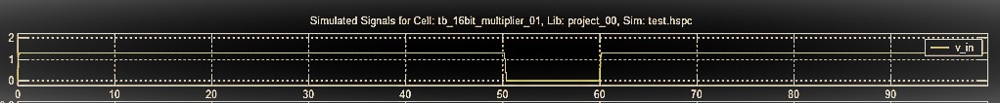
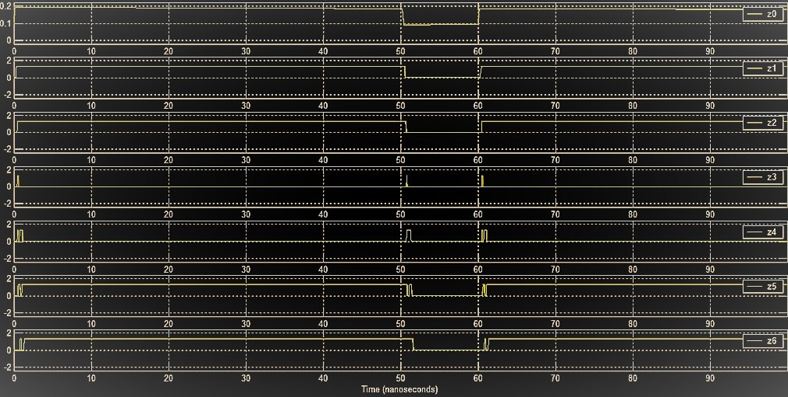
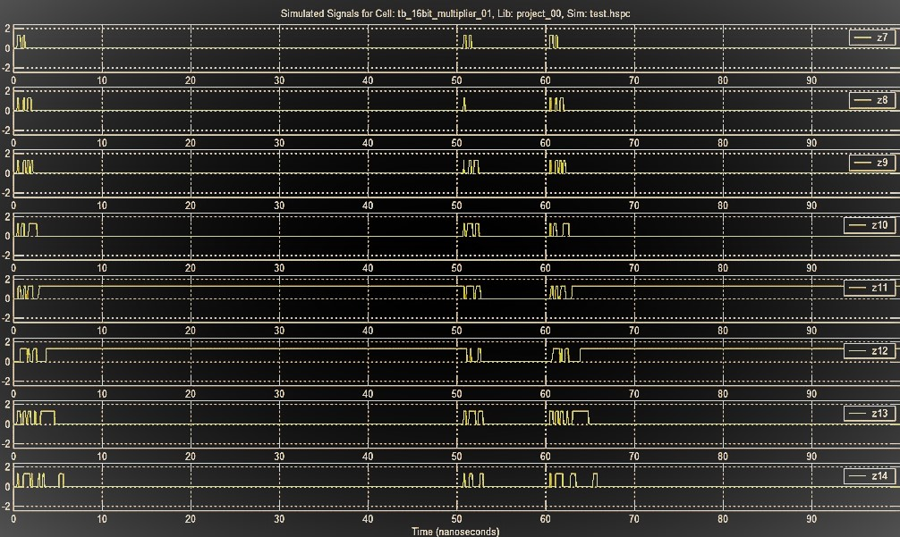
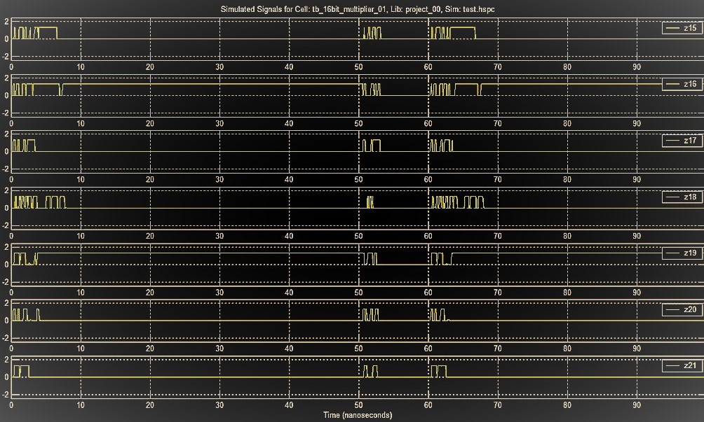
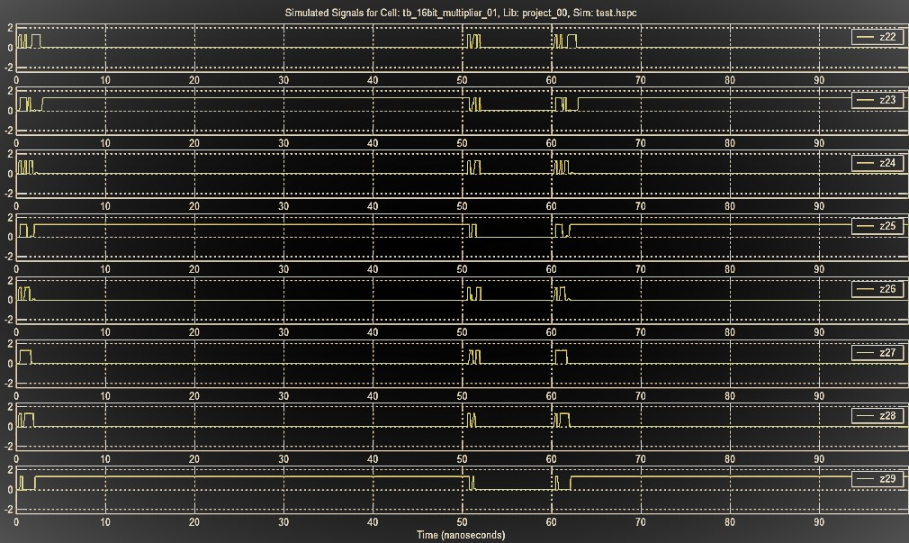
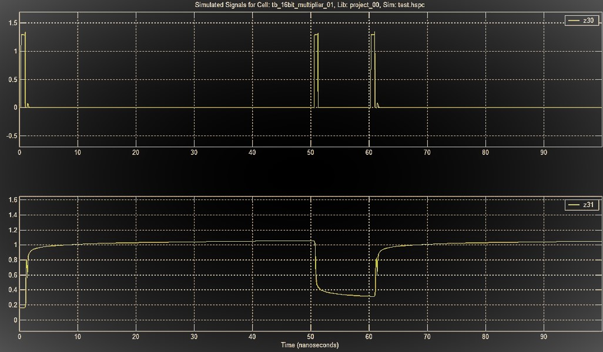

# 32-bit Multiplier Design Using Transistor Level Digital Gates Simulated in SPICE

This project was performed on the completion of our four-week-long B. Tech 4th Semester Summer Training cum Academic Internship Programme on "RISC-V based 32-bit Digital Processor Design using SPICE" under [Electronics & ICT Academy, IIT Guwahati](https://eict.iitg.ac.in/) and [Assam Science & Technology University](https://astu.ac.in/), Guwahati under [TEQIP III](https://www.teqip.in/) in association with [VLSI Expert Private Ltd](https://www.vlsiexpert.com/) during July-August, 2020.

### Directory Structure

* [ASTU__180610026032](./ASTU__180610026032) - schematics for basic digital gates, adders, mux, filters, multipliers, etc.
* [Figures](./Figures) - all the figures used in the final report.
* [Output Images](./Output-Images) - schematics/test-bench images and simulated signal outputs
* [Project_Schematics](./Project_Schematics) - multiplier schematics used in the project
* [TechnoReady_VLSIExpert_DigLib](./TechnoReady_VLSIExpert_DigLib) - schematics provided by VLSI Expert
* [images](./images) - 16/32-bit multiplier schematics and simulation images
* [`32 BIT MULTIPLIER_block_diagram.jpg`](#32%20BIT%20MULTIPLIER_block_diagram.jpg)
* [`32-bit Multiplier Design Presentation.pptx`](#32-bit%20Multiplier%20Design%20Presentation.pptx)
* [`32-bit Multiplier design.docx`](#32-bit%20Multiplier%20design.docx)
* [`Final Report.pdf`](#Final%20Report.pdf)

### Quickview

- [Abstract](#abstract)
- [Introduction](#introduction)
- [Architecture](#architecture)
- [Software Used](#software-used)
- [Circuit Schematics](#circuit-schematics)
- [Result Analysis](#result-analysis)
- [Simulation Plots](#simulation-plots)

## Abstract

This project is based on the designing and simulation of a 32-bit multiplier using transistor-level digital Gates in SPICE. The design is structured with AND operation of one 32 bit number with the first bit of 2nd 32-bit number to get the 1st bit of the 64bit product and again doing the same with the second bit of the second 32-bit number then adding the result to get the second bit of 64-bit product and further iterating these steps for the next bits of the second 32-bit number and adding it to get the next bit of 64-bit product. After successfully achieving the output for the logic in a 16-bit multiplier, 32 bit model of the multiplier could not be tested due to the underperformance of the low-end device. This implies, the logic which has been used to tackle the problem was correct.

## Introduction

A multiplier follows the normal mathematical operation where two numbers are multiplied, now the technical thing about it is that multiplication is the most fundamental operation in most digital signal processing(DSP) algorithms to perform functions like convolution, filtering and processing, so on. The major recent statics shows that more than 69.90% of the instructions perform addition and multiplication in most of the microprocessor and DSP algorithms, .i.e., these operations consume most of the execution time after simulation on compiling. In a system comprising of a multiplier, the system performance is usually determined by the performance of the multiplier as it being the slowest element of all. Henceforth, optimizing the speed of the multiplier is a major design issue. Here due to the complexity and design of different logical circuits combine to form the implementation of the basic 32-bit Multiplier, the speed of running or execution becomes slower, and that’s why, the prior multiplication process can be divided into three steps, namely, generating the partial products, reducing the partial product and the last addition to getting the final product, and also for the speed of multiplication can be improved by reduction in the generated number of partial products or thus by increasing the speed at which these partial products are accumulated. The main proposed solution of the good multiplier is to provide a compact utilization, high speed and low power consumption unit at a certain level of implementation for the betterment of the speed and power usage.

The combinational logical components we use for the implementation and designing of the 32-Bit Multiplier are 32-bit full adder, 32-bit AND gate, the inputs and output lines and for the display of output in CPPsim and the general purpose of multiplication of bits.

* [Adder](https://en.wikipedia.org/wiki/Adder_(electronics)) - Multiplication employs addition in its operations, and their hardware is similar if not identical to additional hardware. Thus, an adder or multiple adders will be in the critical path of the design, so the performance of implementation will be often be limited by the performance of its adders. When we are looking at other attributes of a chip, such as an area or power, it is found that the hardware for addition will be a large contributor to these areas. It is therefore beneficial to choose the correct adder to implement in a design. A Ripple Carry Adder is a logical circuit using multiple full adders (FA) to add N-bit numbers. Each FA inputs a carry Cin which is the Cout of the previous adder. This kind of adder is a Ripple Carry Adder (RCA) since each carry bit "ripples" to the next full adder. The first FA can be replaced by a HA. The layout of an RCA is simple, which allows fast design time. However, the ripple carry adder is relatively slow as it has to wait for the carry bit that comes from the previous full adder.

    `Sum (Si) = (Ai xor Bi) xorCi` and `carry (Ci+1) = (Ai and Bi) or (Ci and (Ai xor Bi))`
    
* [AND gate](https://en.wikipedia.org/wiki/AND_gate) - The output state of a digital logic AND gate only returns “LOW” again when ANY of its inputs are at a logic level “0”. In other words for a logic AND gate, any LOW input will give a LOW output

## Architecture

  

 
The design consists of feeding the 1st 32-bit number with the 1st bit of 2nd 32-bit number to 32*1 AND gate and then extracting the 1st bit of the 64-bit output ( `A0B0` ) then again doing the same operation with `B1` i.e., 2nd bit of the 2nd 32-bit number and then adding the two partial products with the help of 32bit Full Adder circuit to get the 2nd bit of the 64-bit output, i.e., `A1B1 + A0B1`, and then iterating these steps for 31 times to get the left part of the 64-bit number and the rest bits are extracted from the last full adder (Number 31) output.

## Software Used
* [Sue2](https://www.cppsim.com/)

  

* [CppSimView](https://www.cppsim.com/)

  

## Circuit Schematics
                                                         
* 32-bit Multiplier

  

* Zoomed View

  

* Test-bench

  

## Result Analysis

We used the two numbers for testing: 

Input 1: `1111001111001111` ---- `62415` ( decimal form )
Input 2: `1010101010101010` ---- `43690` ( decimal form )

Output:  `10100010100010010101110101110110` ( Theoretical ) ---- `2726911350` ( decimal form )

For supplying the 1st 32-input we connected the input pins:

`A0 A1 A2 A3 A6 A7 A8 A9 A12 A13 A14 A15` to the pulse signal (1)
and 
`A4 A5 A10 A11` to the ground (0)

For the 2nd 32-bit input we connected the input pins: 

`A1 A3 A5 A7 A9 A11 A13 A15` to the pulse signal (1)
and 
`A0 A2 A4 A6 A8 A10 A12 A14` to the ground (0)

## Simulation Plots

* `v_in` ( input signal )

  

* `z0` to `z6`

  

* `z7` to `z14`

  

* `z15` to `z21`

  

* `z22` to `z29`

  

* `z30` and `z31`

  

### Project Collaborators

* [Dip Jyoti Dutta](https://github.com/ZeroDashZero)
* [Gaurab Paul](https://github.com/Gaurab744)
* [Mrinab Dey](https://github.com/mrinab)
* [Pankaj Kumar Sah](https://github.com/52punk)
* [Souvik Das](https://github.com/roc-cyber)